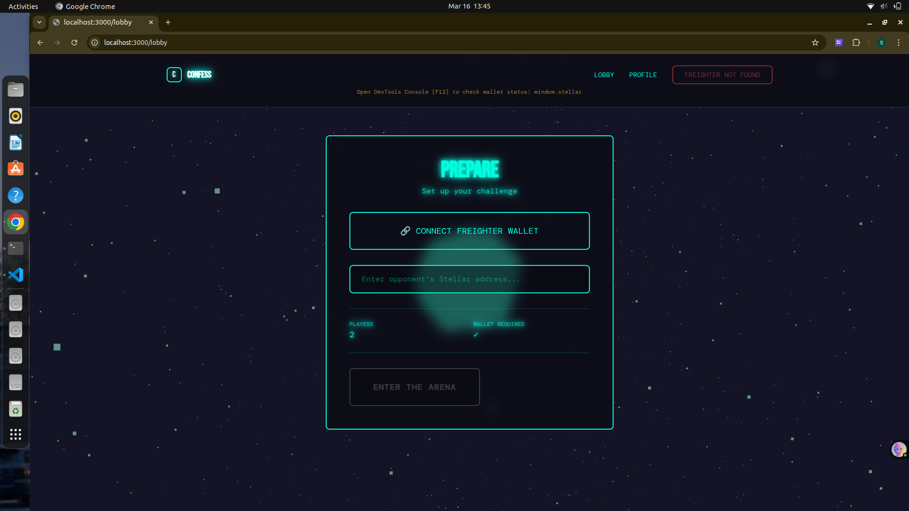

# Truth or Dare - Soroban Smart Contract


## Project Description

**Truth or Dare** is a decentralized game smart contract built on the Stellar blockchain using Soroban. This contract enables peer-to-peer gameplay of the classic Truth or Dare game with on-chain verification and tracking. Players can engage in challenges, complete tasks, and earn verifiable records of their participation directly on the Stellar network.

## What It Does

The Truth or Dare smart contract provides a framework for:

- **Game Session Management**: Create and manage game sessions between two players
- **Challenge Generation**: Generate randomized truth questions and dare challenges through deterministic blockchain randomization
- **Challenge Completion**: Record when players successfully complete challenges with on-chain verification
- **Player Statistics**: Track player engagement and performance metrics

The contract leverages the Soroban SDK to deliver a secure, transparent gaming experience where all game outcomes are immutable and verifiable on the distributed ledger.

## Features

✨ **Core Features**

- **`create_game`**: Initialize a new Truth or Dare game session between two players
  - Generates unique session IDs for game tracking
  - Creates verifiable game instances on the blockchain

- **`get_truth`**: Retrieve a random truth question
  - Deterministically generated questions using ledger data
  - Ensures fairness and unpredictability

- **`get_dare`**: Retrieve a random dare challenge
  - Diverse challenge library for engaging gameplay
  - Deterministically selected challenges

- **`complete_challenge`**: Record a completed challenge
  - Verifiable proof of challenge completion
  - Player and challenge type tracking

- **`get_stats`**: View player statistics and engagement metrics
  - Track player history and performance
  - Verifiable player records on-chain

## Technical Details

### Built With

- **Language**: Rust
- **Framework**: Soroban SDK v25
- **Network**: Stellar Blockchain

### Project Structure

```
contracts/
└── hello-world/
    ├── src/
    │   ├── lib.rs          # Main contract implementation
    │   └── test.rs         # Contract unit tests
    └── Cargo.toml          # Contract dependencies
```

### Running Tests

To run the contract tests:

```bash
cd contracts/hello-world
cargo test
```

### Building the Contract

To build the contract:

```bash
cd contracts/hello-world
cargo build --target wasm32-unknown-unknown
```

## Deployed Smart Contract Link

**Contract Address**: `CALSOMXGUXSM7JGKOO4K52LOCZQW2ERYWFUDITYR5E7VZLWAU7CNHV2B`

**Network**: Stellar Testnet

**Explorer Link**: https://stellar.expert/explorer/testnet/tx/ef22bae483ff8b4c8f44876947afd928af4b30dc171cc9fafbe23103b489f2a5

### Deployment Details

✅ **Contract deployed successfully!**

The contract has been deployed to the Stellar Testnet with the following:
- **Alias Mapping**: `~/.config/stellar/contract-ids/hello_world.json` (allows using `hello_world` alias instead of contract ID)
- **Transaction Hash**: `ef22bae483ff8b4c8f44876947afd928af4b30dc171cc9fafbe23103b489f2a5`
- **WASM Hash**: `0c358b2d2a496c86f0951848185bfc6e350cff5824e2edcb04dc03926f21255d`

You can reference this contract using the alias `hello_world` in future commands instead of the full contract ID.

## Getting Started

### Prerequisites

- Rust 1.70+
- Stellar CLI
- Soroban CLI

### Installation & Setup

1. Clone the repository:
```bash
git clone <repository-url>
cd truthordare
```

2. Install dependencies:
```bash
cargo build
```

3. Run tests:
```bash
cargo test
```

## Usage Example

```rust
// Create a new game session
let session_id = client.create_game(&player1, &player2);

// Get a random truth question
let truth = client.get_truth();

// Get a random dare challenge
let dare = client.get_dare();

// Record a completed challenge
let result = client.complete_challenge(&player, &challenge_type);

// View player statistics
let stats = client.get_stats(&player);
```

## Future Enhancements

- 🎮 Multiplayer support (3+ players)
- 💾 Persistent on-chain game history
- 🏆 Leaderboard and achievement system
- 🎁 Reward system using Stellar tokens
- 🔐 Enhanced randomization with VRF
- 📊 Advanced analytics and statistics
- 🌐 Web frontend integration

## Documentation

For comprehensive information about Soroban smart contracts, visit:
- [Stellar Soroban Documentation](https://developers.stellar.org/docs/build/smart-contracts/overview)
- [Soroban Examples Repository](https://github.com/stellar/soroban-examples)

## License

This project is licensed under the MIT License - see LICENSE file for details.

## Support

For questions or issues, please:
- Open an issue on GitHub
- Check the [Stellar Developers Discord](https://discord.gg/stellar)
- Visit [Stellar Community Forums](https://stellar.org/community)

---

**Built for the Stellar Ecosystem** 🚀
